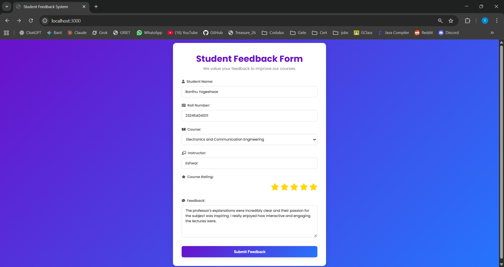

# student-feedback-system
Student Feedback System
A simple and modern web application for collecting feedback from students about their courses and instructors. The application features a clean user interface and a robust backend to store and manage the feedback data securely in a MySQL database.

Features
User-Friendly Form: An intuitive and responsive HTML form for easy data entry.

Dynamic Star Rating: An interactive 5-star rating system for course evaluation.

Data Persistence: All feedback is securely stored in a MySQL database.

Node.js Backend: Built with a lightweight and efficient Express.js server.

Clean Architecture: Separation of concerns with dedicated files for database connection, queries, and server logic.

Tech Stack
This project is built with the following technologies:

Category

Technology

Frontend

HTML5, CSS3

Backend

Node.js, Express.js

Database

MySQL

Libraries

mysql2, body-parser

Styling

Font Awesome (for icons), Google Fonts

Prerequisites
Before you begin, ensure you have the following installed on your local machine:

Node.js (which includes npm)

[suspicious link removed]

Installation & Setup
Follow these steps to get the project up and running on your local machine.

1. Clone the repository:

git clone [https://github.com/YourUsername/your-repo-name.git](https://github.com/YourUsername/your-repo-name.git)
cd your-repo-name

2. Install dependencies:
This command will install all the required packages from package.json.

npm install

3. Set up the MySQL Database:
a. Log in to your MySQL server.

b. Create a new database for the project.

CREATE DATABASE feedback_system;

c. Open the db.js file and update the database connection details with your credentials.

// db.js
const connection = mysql.createConnection({
    host: 'localhost',
    user: 'root', // Your MySQL username
    password: '1234', // Your MySQL password
    database: 'feedback_system'
});

The application will automatically create the feedback table for you when it first connects.

Usage
Once the setup is complete, you can start the server with the following command:

node server.js

The server will start, and you should see the following message in your terminal:
Server is up and running on http://localhost:3000

Now, open your web browser and navigate to http://localhost:3000 to use the application.

File Structure
Here is a quick overview of the key files in this project:

.
├── server.js           # The main Express server file (entry point)
├── index.html          # The frontend feedback form
├── style.css           # CSS file for styling the form
├── db.js               # Handles the MySQL database connection
├── queries.js          # Contains all SQL query strings
├── package.json        # Lists project dependencies and scripts
└── README.md           # You are here!
